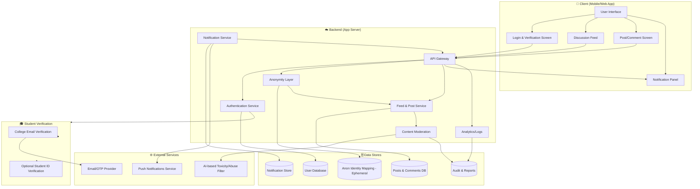

# Blind App

Anonymous Community App for College Students

- **Project:** Create an app similar to Blind for anonymous discussions among verified college students.

some rules:

- work on ui with ai, but not like directly gave it to handle
- ui needs to be like not ai generated

easy boy, first create a system design, what features you want to have, really try to think, don't think everything at once, step by step
layout fucking 1-2-3 steps, then push them step by step

work on system design first

