```mermaid
flowchart TD
    subgraph Client["📱 Client (Mobile/Web App)"]
        U[User Interface]
        AuthUI[Login & Verification Screen]
        FeedUI[Discussion Feed]
        PostUI[Post/Comment Screen]
        NotifUI[Notification Panel]
    end

    subgraph Backend["☁️ Backend (App Server)"]
        API[API Gateway]
        AuthService[Authentication Service]
        AnonService[Anonymity Layer]
        FeedService[Feed & Post Service]
        NotifService[Notification Service]
        ModerationService[Content Moderation]
        AnalyticsService[Analytics/Logs]
    end

    subgraph Verification["🎓 Student Verification"]
        EmailCheck[College Email Verification]
        IDCheck[Optional Student ID Verification]
    end

    subgraph DataStore["🗄️ Data Stores"]
        UserDB[(User Database)]
        PostDB[(Posts & Comments DB)]
        AnonMapDB[(Anon Identity Mapping - Ephemeral)]
        NotifDB[(Notification Store)]
        LogDB[(Audit & Reports)]
    end

    subgraph Ext["🌐 External Services"]
        EmailAPI[Email/OTP Provider]
        PushAPI[Push Notifications Service]
        AIAPI[AI-based Toxicity/Abuse Filter]
    end

    %% Client connections
    U --> AuthUI
    U --> FeedUI
    U --> PostUI
    U --> NotifUI

    %% Flow: Auth & Verification
    AuthUI --> API --> AuthService --> Verification
    Verification --> EmailCheck --> EmailAPI
    Verification --> IDCheck
    AuthService --> UserDB

    %% Flow: Anonymity
    PostUI --> API --> AnonService
    AnonService --> AnonMapDB
    AnonService --> FeedService

    %% Flow: Feed & Posts
    FeedUI --> API --> FeedService
    FeedService --> PostDB

    %% Flow: Moderation
    FeedService --> ModerationService
    ModerationService --> AIAPI
    ModerationService --> LogDB

    %% Flow: Notifications
    NotifService --> NotifDB
    NotifService --> PushAPI
    API --> NotifUI
    NotifService --> API

    %% Flow: Analytics
    API --> AnalyticsService
    AnalyticsService --> LogDB

```

# Blind App

[](LICENSE)
[](https://github.com/NalinDalal/blind-app/actions)
[](https://github.com/NalinDalal/blind-app/issues)

> Anonymous Community App for College Students

---

## Table of Contents
- [Features](#features)
- [Quickstart](#quickstart)
- [Tech Stack](#tech-stack)
- [System Design](#system-design)
- [Documentation](#documentation)
- [Community & Contributing](#community--contributing)
- [License](#license)

---

## Features
- Anonymous posting and commenting
- College-verified community (only `@oriental.ac.in` emails)
- OTP-based authentication (2FA)
- Real-time notifications (planned)
- Content moderation (AI filter planned)
- Responsive, accessible UI (dark/light mode)
- Progressive Web App support

## Quickstart
```bash
# Clone the repo
$ git clone https://github.com/NalinDalal/blind-app.git
$ cd blind-app

# Install dependencies
$ npm install

# Setup environment variables
$ cp .env.example .env.local
# Edit .env.local with your credentials

# Setup database
$ npx prisma generate
$ npx prisma db push
$ npm run db:seed

# Start development server
$ npm run dev
```

## Tech Stack
- **Frontend:** Next.js 15, React 19, TypeScript, Tailwind CSS
- **Backend:** Next.js API Routes, Prisma ORM, PostgreSQL
- **Auth:** JWT, bcryptjs, OTPAuth
- **State:** Redux Toolkit
- **Forms:** React Hook Form, Zod
- **Email:** SendGrid
- **Deployment:** Vercel

## System Design
The following diagram illustrates the overall architecture of Blind App:



## Documentation
- [API Reference](docs/API.md)
- [System Architecture](docs/ARCHITECTURE.md)
- [Component Docs](docs/COMPONENTS.md)
- [Contributing Guide](docs/CONTRIBUTING.md)
- [Roadmap](docs/ROADMAP.md)
- [OpenAPI Spec](docs/OPENAPI.yaml)

## Community & Contributing
We welcome contributions! Please read our [Contributing Guide](docs/CONTRIBUTING.md) and [Roadmap](docs/ROADMAP.md) for details.

- [Open Issues](https://github.com/NalinDalal/blind-app/issues)
- [Discussions](https://github.com/NalinDalal/blind-app/discussions)

## License
This project is licensed under the MIT License. See [LICENSE](LICENSE) for details.
