# Blind App

[](LICENSE)
[](https://github.com/NalinDalal/blind-app/actions)
[](https://github.com/NalinDalal/blind-app/issues)

> Anonymous Community App for College Students

---

## Table of Contents
- [Features](#features)
- [Quickstart](#quickstart)
- [Tech Stack](#tech-stack)
- [System Design](#system-design)
- [Documentation](#documentation)
- [Community & Contributing](#community--contributing)
- [License](#license)

---

## Features
-   **Anonymous Interaction:** Post, comment, and reply without revealing your real identity.
-   **College-Verified Community:** Exclusively for students with a valid `@oriental.ac.in` email address.
-   **Secure Authentication:** Custom JWT-based authentication flow with an OTP (One-Time Password) verification system.
-   **Content Moderation:** Built-in filter to detect and block inappropriate content in posts and comments.
-   **Replies & Likes:** Supports nested comment replies and liking comments.
-   **Theming:** Dark and light mode support.
-   **Real-time Notifications (Planned):** Functionality to receive push notifications for interactions.


## Quickstart
```bash
# Clone the repo
$ git clone https://github.com/NalinDalal/blind-app.git
 
$ cd blind-app

# Install dependencies
$ npm install

# Setup environment variables
$ cp .env.example .env.local
# Edit .env.local with your PostgreSQL and SendGrid credentials

# Setup database
$ npx prisma generate
$ npx prisma db push
$ npm run db:seed

# Start development server
$ npm run dev
```

## Tech Stack
 
- **Framework:** Next.js (App Router)
- **Language:** Typescript
- **Backend:** Next.js API Routes
- **Database:** PostgreSQL with Prisma ORM
- **Authentication:**
    - `bcryptjs` - password hashing
    - `OTPauth` - TOTP/OTP generation & verification
    - `jsonwebtoken` - issue and verify JWT access & refresh tokens
- **State Management:**
  - **Client State:** [Redux Toolkit](https://redux-toolkit.js.org/) (for auth state)
  - **Server State:** [TanStack Query](https://tanstack.com/query/latest) (for data fetching, caching, and mutations)
- **UI:** [React 19](https://react.dev/), [TailwindCSS](https://tailwindcss.com/)
- **Form Handling:** React Hook Form with Zod for validation
- **Email Service:** SendGrid
- **Deployment:** Docker

## System Design
The following diagram illustrates the overall architecture of Blind App:

```mermaid
flowchart TD
  subgraph Client["📱 Client (Web App)"]
    U[User Interface]
    AuthUI[Login & Verification Screen]
    FeedUI[Discussion Feed]
    PostUI[Post/Comment Screen]
    NotifUI[Notification Panel]
  end

  subgraph Backend["☁️ Backend (Next.js API Routes)"]
    API[API Gateway]
    AuthService[Authentication Service]
    AnonService[Anonymity Layer]
    FeedService[Feed & Post Service]
    NotifService[Notification Service]
    ModerationService[Content Moderation]
  end

  subgraph Verification["🎓 Student Verification"]
    EmailCheck[College Email Verification]
  end

  subgraph DataStore["🗄️ Data Stores (PostgreSQL)"]
    UserDB[(User Database)]
    PostDB[(Posts & Comments DB)]
    AnonMapDB[(Anon Identity Mapping)]
    NotifDB[(Notification Store)]
    LogDB[(Audit Logs)]
  end

subgraph Ext["🌐 External Services"]
EmailAPI[Email/OTP Provider]
end

%% Client connections
U --> AuthUI
U --> FeedUI
U --> PostUI
U --> NotifUI

%% Flow: Auth & Verification
AuthUI --> API --> AuthService
AuthService --> Verification
Verification --> EmailCheck --> EmailAPI
AuthService --> UserDB

%% Flow: Anonymity
PostUI --> API --> AnonService
AnonService --> AnonMapDB
AnonService --> FeedService

%% Flow: Feed & Posts
FeedUI --> API --> FeedService
FeedService --> PostDB

%% Flow: Moderation
FeedService --> ModerationService
ModerationService --> LogDB

%% Flow: Notifications
NotifService --> NotifDB
API --> NotifUI
NotifService --> API

```



## Documentation
- [API Reference](docs/API.md)
- [System Architecture](docs/ARCHITECTURE.md)
- [Component Docs](docs/COMPONENTS.md)
- [Contributing Guide](docs/CONTRIBUTING.md)
- [Roadmap](docs/ROADMAP.md)
- [OpenAPI Spec](docs/OPENAPI.yaml)

## Community & Contributing
We welcome contributions! Please read our [Contributing Guide](docs/CONTRIBUTING.md) and [Roadmap](docs/ROADMAP.md) for details.

- [Open Issues](https://github.com/NalinDalal/blind-app/issues)
- [Discussions](https://github.com/NalinDalal/blind-app/discussions)

## License
This project is licensed under the MIT License. See [LICENSE](LICENSE.md) for details.
