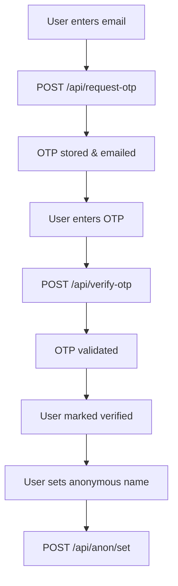

## System Overview

Blind App is a Next.js-based platform for anonymous college community communication. Privacy is enforced via anonymous identity mapping and verified college email authentication.

## Architecture Principles

- **Anonymity-First Design:** Anonymous names mapped to verified accounts; mapping stored separately from posts/comments.
- **College-Verified Community:** Only `@oriental.ac.in` emails; OTP verification for email ownership.
- **Stateless Authentication:** JWT tokens; no server-side session storage.

## Technology Stack

- **Frontend:** Next.js 15, React 19, TypeScript, Tailwind CSS, Redux Toolkit, React Hook Form, Zod
- **Backend:** Next.js API Routes, Prisma ORM, PostgreSQL, JWT, bcryptjs, OTPAuth
- **External:** SendGrid (email), Vercel (deployment)

## Database Schema

See [`prisma/schema.prisma`](../prisma/schema.prisma) and [migrations](../prisma/migrations/).

**Core Entities:**

```
User { id, email, password, otp, verified, createdAt, updatedAt }
AnonMapping { id, userId, anonName, createdAt }
Post { id, content, userId, college, createdAt, updatedAt }
Comment { id, content, postId, userId, createdAt }
Like { id, commentId, userId, createdAt }
```

**Key Relationships:**

- 1:1 User ↔ AnonMapping (optional)
- 1:N User → Posts
- 1:N Post → Comments
- 1:N Comment → Likes

## Authentication Flow



## Security Architecture

- **Multi-Layer Authentication:** Email verification, OTP, JWT
- **Rate Limiting:** OTP requests (30s/email)
- **Data Privacy:** Anonymous mapping, bcrypt password hashing
- **Input Validation:** Zod schemas, Prisma ORM, React XSS protection

## System Components

- Authentication Service
- Content Management
- Notification System
- User Interface

## Deployment Architecture

- **Frontend:** Vercel Edge Network
- **API:** Vercel Serverless Functions
- **Database:** PostgreSQL (cloud)
- **Email:** SendGrid API
- **Assets:** CDN

## Monitoring & Observability

- Error logging
- Authentication event tracking
- Performance metrics

## Future Enhancements

- Real-time features (WebSocket)
- AI-powered content moderation
- Analytics & metrics
- Mobile apps
- Microservices

## See Also

- [API Reference](API.md)
- [Component Docs](COMPONENTS.md)
- [OpenAPI Spec](OPENAPI.yaml)
